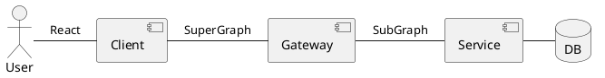

# cloud-native

Cloud native technologies empower organizations to build and run scalable applications in modern, dynamic environments such as public, private, and hybrid clouds. Containers, service meshes, microservices, immutable infrastructure, and declarative APIs exemplify this approach.

# アーキテクチャ

Client - Gateway -\* Services



## フロントエンド(`frontend`)

### プロジェクトのベースラインを作成する

```sh
$ git clone https://github.com/angelguzmaning/ts-redux-react-realworld-example-app.git
$ mv ts-redux-react-realworld-example-app frontend
```

## バックエンド(`backend`)

### プロジェクトのベースラインを作成する

`moleculer-cli`(`Command line tool for Moleculer framework NPM version`) をインストール

```sh
$ sudo npm install -g moleculer-cli
```

`Moleculer template: project-typescript` でベースラインを作成する

```sh
$ moleculer init project-typescript backend
Template repo: moleculerjs/moleculer-template-project-typescript
Downloading template...
? Add API Gateway (moleculer-web) service? Yes
? Would you like to communicate with other nodes? Yes
? Select a transporter NATS (recommended)
? Would you like to use cache? Yes
? Select a cacher solution Redis
? Add DB sample service? Yes
? Would you like to enable metrics? Yes
? Select a reporter solution Prometheus
? Would you like to enable tracing? Yes
? Select a exporter solution Console
? Add Docker & Kubernetes sample files? Yes
? Use ESLint to lint your code? Yes
Create 'backend' folder...
? Would you like to run 'npm install'? Yes

Running 'npm install'...
```
